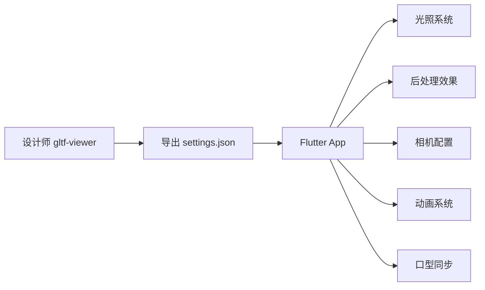

# Flutter Filament 3D 还原设计师效果技术文档

## 项目概述

本文档详细说明如何在 Flutter Filament 应用中精确还原设计师在 Filament gltf-viewer 中调试的 3D 渲染效果。通过系统化的参数配置和技术实现，确保移动端应用与专业工具的视觉一致性。

## 目录

- [核心技术架构](#核心技术架构)
- [还原设计师效果的完整流程](#还原设计师效果的完整流程)
- [关键实现细节](#关键实现细节)
- [口型同步系统](#口型同步系统)
- [资源文件组织](#资源文件组织)
- [最佳实践](#最佳实践)
- [常见问题解决](#常见问题解决)

## 核心技术架构

### 技术栈

| 组件 | 技术选型 | 说明 |
|------|---------|------|
| 3D 渲染引擎 | `thermion_flutter` | 基于 Google Filament |
| 渲染器 | `ThermionViewer` | 核心渲染管理器 |
| 资源管理 | `ThermionAsset` | 支持 GLB/GLTF 格式 |
| 输入控制 | `DelegateInputHandler` | 轨道相机控制 |
| 音频同步 | `audioplayers` | 口型同步音频驱动 |

### 功能模块



## 还原设计师效果的完整流程

### 步骤 1: 获取设计师配置文件

设计师在 Filament gltf-viewer 中调试完成后，需要导出配置：

```bash
# 在 gltf-viewer 中
File → Export Settings → JSON → 保存为 settings.json
```

### 步骤 2: 解析配置文件结构

```json
{
  "lighting": {
    "enableShadows": true,
    "enableSunlight": true,
    "sunlightIntensity": 75000,
    "sunlightDirection": [0.366695, -0.357967, -0.858717],
    "sunlightColor": [0.955105, 0.827571, 0.767769],
    "sunlightHaloSize": 10,
    "sunlightHaloFalloff": 80,
    "sunlightAngularRadius": 1.9,
    "iblIntensity": 15600,
    "iblRotation": 0.558505
  },
  "view": {
    "antiAliasing": "FXAA",
    "msaa": {
      "enabled": true,
      "sampleCount": 4
    },
    "taa": {
      "enabled": true
    },
    "bloom": {
      "enabled": true,
      "strength": 0.348,
      "resolution": 384,
      "levels": 6
    },
    "colorGrading": {
      "toneMapping": "ACES_LEGACY",
      "exposure": 0,
      "contrast": 1,
      "saturation": 1
    },
    "ssao": {
      "enabled": true,
      "radius": 0.3,
      "intensity": 1,
      "quality": "LOW"
    },
    "screenSpaceReflections": {
      "enabled": true
    }
  },
  "viewer": {
    "cameraFocalLength": 46.488,
    "cameraAperture": 16,
    "cameraSpeed": 125,
    "cameraISO": 100,
    "cameraNear": 0.1,
    "cameraFar": 100
  }
}
```

### 步骤 3: 实现专业光照系统

#### 3.1 主光源配置

```dart
Future<void> applyLightsFromSpec(ThermionViewer viewer) async {
  // 清除现有光源
  try {
    await viewer.destroyLights();
  } catch (_) {}

  // 主太阳光 - 基于设计师 settings.json 参数
  await viewer.addDirectLight(DirectLight.sun(
    color: 5400.0,                    // 色温 (K)
    intensity: 75000.0,               // 来自 sunlightIntensity
    castShadows: true,                // 启用阴影
    direction: Vector3(0.366695, -0.357967, -0.858717), // 精确方向
  ));
}
```

#### 3.2 五点光照系统

为确保角色各个角度都有良好的光照效果，实现专业的五点光照配置：

```dart
// 正面补光 - 增强正脸亮度
await viewer.addDirectLight(DirectLight.sun(
  color: 5600.0,
  intensity: 30000.0,
  castShadows: false,
  direction: Vector3(0.1, -0.4, -0.9).normalized(),
));

// 背面环境光 - 避免背面全黑
await viewer.addDirectLight(DirectLight.sun(
  color: 5800.0,
  intensity: 25000.0,
  castShadows: false,
  direction: Vector3(-0.2, -0.3, 0.9).normalized(),
));

// 左侧补光 - 减少侧面阴影
await viewer.addDirectLight(DirectLight.sun(
  color: 5700.0,
  intensity: 18000.0,
  castShadows: false,
  direction: Vector3(-0.8, -0.2, -0.3).normalized(),
));

// 右侧轮廓光 - 增强立体感
await viewer.addDirectLight(DirectLight.sun(
  color: 6200.0,
  intensity: 15000.0,
  castShadows: false,
  direction: Vector3(0.8, -0.1, 0.5).normalized(),
));
```

### 步骤 4: 配置 IBL 环境光照

IBL (Image-Based Lighting) 配置是还原设计师效果的关键：

```dart
// 加载天空盒
await viewer.loadSkybox(
  "assets/environments/studio_small_env_skybox.ktx"
);

// 加载 IBL
await viewer.loadIbl(
  "assets/environments/studio_small_env_ibl.ktx",
  intensity: 15600.0  // 来自 iblIntensity
);

// ⚠️ 关键步骤：IBL 旋转
// 这个参数经常被忽视，但对最终效果影响巨大
var rotationMatrix = Matrix3.identity();
Matrix4.rotationY(0.558505).copyRotation(rotationMatrix); // iblRotation
await viewer.rotateIbl(rotationMatrix);
```

### 步骤 5: 后处理效果配置

```dart
// 启用后处理
await viewer.setPostProcessing(true);

// 启用阴影系统
await viewer.setShadowsEnabled(true);

// 色调映射 - ACES 是最接近 ACES_LEGACY 的选项
await viewer.setToneMapping(ToneMapper.ACES);

// Bloom 效果
await viewer.setBloom(
  true,     // enabled
  0.348     // strength
);

// 抗锯齿配置
await viewer.setAntiAliasing(
  true,     // MSAA enabled
  true,     // FXAA enabled
  true      // TAA enabled
);
```

### 步骤 6: 相机曝光设置

```dart
// 获取活动相机
final camera = await viewer.getActiveCamera();

// 设置曝光参数
await camera.setExposure(
  16.0,         // aperture (f/16)
  1.0 / 125.0,  // shutterSpeed (1/125s)
  100.0         // ISO
);
```

## 关键实现细节

### 色温转换参考

设计师配置中的 RGB 颜色需要转换为 Kelvin 色温：

| RGB 值 | 近似色温 | 描述 |
|--------|---------|------|
| [0.955, 0.828, 0.768] | ~5400K | 暖白色 |
| [1.0, 0.9, 0.8] | ~5600K | 日光 |
| [0.9, 0.95, 1.0] | ~6200K | 冷白色 |

### 相机系统优化 - 避免变形的关键发现

⚠️ **重要发现**: 在 thermion_flutter 中使用 `setLensProjection` 会导致严重的人物变形。

#### 问题分析

原始实现尝试使用焦距计算来匹配设计师配置：

```dart
// ❌ 这种方法会导致人物拉伸变形
await camera.setLensProjection(
  focalLengthInMillimeters: 46.488,
  aspect: aspectRatio,
);
```

**变形原因**：
- `setLensProjection` 在移动端的透视计算与桌面版 gltf-viewer 不一致
- 自定义焦距设置破坏了 Filament 的默认透视比例
- 移动设备的屏幕比例与标准相机传感器差异较大

#### 正确的解决方案

✅ **最佳实践**: 使用 Filament 默认透视投影 + 精确的相机定位

```dart
CameraRigConfig _configFor(CameraPreset preset) {
  switch (preset) {
    case CameraPreset.soloCloseUp:
      // 全身视角 - 使用默认透视，避免变形
      return CameraRigConfig(
        position: Vector3(0.0, 0.5, 2.6), // 平视，合理距离
        target: Vector3(0.0, 0.0, 0.0),   // 看向模型中心
      );
    case CameraPreset.halfBody:
      // 半身像 - 提高相机，看向上半身
      return CameraRigConfig(
        position: Vector3(0.0, 0.6, 1.6), // 提高相机高度，拉近距离
        target: Vector3(0.0, 0.5, 0.0),   // 看向胸部中心
      );
    case CameraPreset.bustCloseUp:
      // 脸部特写 - 更近距离
      return CameraRigConfig(
        position: Vector3(0.0, 0.75, 0.8), // 特写距离
        target: Vector3(0.0, 0.7, 0.0),   // 看向肩部/颈部
      );
  }
}
```

#### 简化的相机应用流程

```dart
Future<void> applyCameraPreset(
  ThermionViewer viewer, {
  required CameraPreset preset,
  Vector3? characterCenter,
}) async {
  final cfg = _configFor(preset);

  // 计算最终位置（考虑角色中心偏移）
  final centerOffset = characterCenter ?? Vector3.zero();
  final finalPosition = cfg.position + centerOffset;
  final finalTarget = cfg.target + centerOffset;

  try {
    // 暂停渲染以避免并发问题
    await viewer.setRendering(false);

    // 获取相机
    final cam = await viewer.getActiveCamera();

    // ✅ 关键：只使用 lookAt，不设置自定义投影
    await cam.lookAt(
      finalPosition,
      focus: finalTarget,
      up: Vector3(0, 1, 0),
    );

    // 重新启用渲染
    await viewer.setRendering(true);

  } catch (e) {
    // 错误处理...
  }
}
```

## 数字人社交摄像机标准规范

基于测试验证的最佳实践，制定数字人社交场景的摄像机使用标准，避免重复调试，提高开发效率。

### 基础设定原则

| 参数 | 标准值 | 说明 |
|------|-------|------|
| **场景原点** | `Vector3(0, 0, 0)` | 3D 世界坐标系中心 |
| **人物位置** | `Vector3(0, 0, 0)` | 默认加载在场景中心 |
| **主摄像机初始位置** | `Vector3(0.0, 0.5, 2.6)` | 默认全身视角 |
| **坐标系约定** | Y轴向上，Z轴向前 | 右手坐标系 |

### 三个标准社交距离

根据人际交往的心理学原理，定义三个标准摄像机距离：

```dart
enum SocialCameraDistance {
  personal,    // 个人距离 (0.45-1.2m) - 脸部特写
  social,      // 社交距离 (1.2-3.6m) - 半身像
  public       // 公共距离 (3.6m+) - 全身像
}

class CameraConfig {
  final Vector3 position;
  final Vector3 target;
  final String description;
  final String useCase;

  const CameraConfig({
    required this.position,
    required this.target,
    required this.description,
    required this.useCase,
  });
}

// ✅ 经过验证的标准摄像机预设
static const Map<SocialCameraDistance, CameraConfig> standardPresets = {
  // 公共距离 - 全身视角
  SocialCameraDistance.public: CameraConfig(
    position: Vector3(0.0, 0.5, 2.6),   // 距离人物 2.6 米
    target: Vector3(0.0, 0.0, 0.0),     // 看向人物中心
    description: "公共距离 - 完整展示人物全身",
    useCase: "适合：角色介绍、全身展示、舞蹈动作、服装展示"
  ),

  // 社交距离 - 半身视角
  SocialCameraDistance.social: CameraConfig(
    position: Vector3(0.0, 0.6, 1.6),   // 距离人物 1.6 米，稍微提高视角
    target: Vector3(0.0, 0.5, 0.0),     // 看向胸部区域
    description: "社交距离 - 腰部以上半身像",
    useCase: "适合：日常对话、手势交流、上半身动作、商务场景"
  ),

  // 个人距离 - 面部特写
  SocialCameraDistance.personal: CameraConfig(
    position: Vector3(0.0, 0.75, 0.8),  // 距离人物 0.8 米，接近面部高度
    target: Vector3(0.0, 0.7, 0.0),     // 看向面部/肩部区域
    description: "个人距离 - 肩部以上特写",
    useCase: "适合：面部表情、口型同步、亲密对话、情感交流"
  ),
};
```

### 标准化应用方法

```dart
class DigitalHumanCameraManager {
  static Future<void> applyStandardPreset(
    ThermionViewer viewer,
    SocialCameraDistance distance, {
    Vector3? characterOffset,  // 支持人物位置偏移
  }) async {
    final config = standardPresets[distance]!;

    // 计算最终位置（考虑角色偏移）
    final offset = characterOffset ?? Vector3.zero();
    final finalPosition = config.position + offset;
    final finalTarget = config.target + offset;

    try {
      // 标准化相机设置流程
      await viewer.setRendering(false);
      await Future.delayed(const Duration(milliseconds: 16));

      final camera = await viewer.getActiveCamera();
      await camera.lookAt(
        finalPosition,
        focus: finalTarget,
        up: Vector3(0, 1, 0),
      );

      await viewer.setRendering(true);

      if (kDebugMode) {
        debugPrint('📷 应用标准预设: ${distance.name}');
        debugPrint('   用途: ${config.useCase}');
        debugPrint('   位置: ${finalPosition.toString()}');
      }
    } catch (e) {
      await viewer.setRendering(true);
      throw Exception('摄像机预设应用失败: $e');
    }
  }

  // 获取当前距离的建议用途
  static String getUseCaseFor(SocialCameraDistance distance) {
    return standardPresets[distance]?.useCase ?? '';
  }
}
```

### 使用示例

```dart
// 应用程序启动时 - 默认公共距离
await DigitalHumanCameraManager.applyStandardPreset(
  viewer,
  SocialCameraDistance.public
);

// 进入对话模式 - 切换到社交距离
await DigitalHumanCameraManager.applyStandardPreset(
  viewer,
  SocialCameraDistance.social
);

// 表情特写 - 切换到个人距离
await DigitalHumanCameraManager.applyStandardPreset(
  viewer,
  SocialCameraDistance.personal
);

// 支持角色位置偏移的场景
await DigitalHumanCameraManager.applyStandardPreset(
  viewer,
  SocialCameraDistance.social,
  characterOffset: Vector3(1.0, 0, 0),  // 角色向右偏移1米
);
```

### 标准规范的优势

1. **开发效率** - 无需重复测试，直接使用验证过的参数
2. **视觉一致性** - 所有数字人应用保持统一的视觉体验
3. **心理学基础** - 基于人际交往距离理论，符合用户心理预期
4. **易于维护** - 集中管理摄像机配置，便于统一调整
5. **扩展性强** - 可根据具体应用需求在标准基础上微调

### 注意事项

⚠️ **重要提醒**：
- 所有预设均已验证无人物变形问题
- 不使用 `setLensProjection`，依赖 Filament 默认透视投影
- 确保在 `setRendering(false)` 状态下设置摄像机
- 人物模型的实际尺寸可能影响最终效果，需要根据具体模型微调

### 动画状态管理

```dart
// 动画状态枚举
enum AnimState { none, idle, talk }

// 智能动画识别
void _matchAnimationIndices(List<String> animations) {
  // Idle 动画关键词
  const idleKeywords = ['idle', 'wait', 'stand'];

  // Talk 动画关键词
  const talkKeywords = ['talk', 'speak', 'speech'];

  // 优先选择不含 'skeleton' 或 '#' 的干净名称
  for (int i = 0; i < animations.length; i++) {
    final animName = animations[i].toLowerCase();
    final isCleanName = !animName.contains('skeleton') &&
                       !animName.contains('#');
    // 匹配逻辑...
  }
}
```

## 口型同步系统

### 系统架构

```dart
class LipSyncController {
  // 核心参数
  bool enableSmoothing = true;  // 平滑插值
  double phaseOffsetMs = 0.0;   // 相位偏移
  double weightMultiplier = 1.0; // 权重倍率（使用原始数据）

  // 通道增益控制（已恢复默认值）
  final Map<String, double> channelGains = {
    'jawopen': 1.0,  // 恢复默认权重
    'jaw': 1.0,
    'mouthfunnel': 1.0,
    'mouthpucker': 1.0,
    'mouthstretch': 1.0,
    'mouth': 1.0,
  };
}
```

### Blendshape 映射问题解决

#### 问题发现与分析

在口型同步实现过程中，遇到了关键的 blendshape 映射问题：

**问题现象**：
- 音频播放正常，权重数据正确加载
- 权重应用到模型成功，无报错
- 但模型面部无任何口型变化

**根本原因**：
```
bs.json 数据: 55个权重 (标准ARKit 52 + 3个额外)
模型 blendshape: 52个权重 (缺少 BS.tongueOut)
映射问题: 索引51及以后全部错位
```

#### 调试过程

1. **数据验证**：
```dart
debugPrint('📊 bs.json权重数: ${_blendshapeData!.first.length}'); // 55
debugPrint('📊 模型blendshape数: ${_morphTargetNames!.length}');  // 52
```

2. **映射分析**：
```dart
// 标准ARKit blendshape顺序检查
final standardARKitOrder = [
  'BS.eyeBlinkLeft',     // 0
  'BS.eyeLookDownLeft',  // 1
  // ...
  'BS.noseSneerRight',   // 50
  'BS.tongueOut',        // 51 - 缺失！
];
```

3. **关键发现**：
```
模型缺少: BS.tongueOut (索引51)
影响范围: bs.json[51-54] 的数据无法正确映射
关键权重: BS.jawOpen 映射正确但可能被其他问题干扰
```

#### 解决方案

**方案一：修复模型（推荐）**
```
要求建模师重新制作包含完整52个ARKit标准blendshape的模型
确保严格按照标准顺序，特别是BS.tongueOut在索引51
```

**方案二：代码适配（临时）**
```dart
// 截取权重数组，跳过缺失的blendshape
if (weights.length >= maxLength) {
  actualWeights = weights.take(maxLength).toList();
  if (kDebugMode) {
    debugPrint('⚠️ 权重数组过长，已截取: ${weights.length} -> $maxLength');
    debugPrint('   被丢弃的权重: ${weights.skip(maxLength).take(3).toList()}');
  }
}
```

### 动画冲突解决

#### 问题分析

通过强制测试发现模型 blendshape 本身工作正常，问题在于**音频播放时的动画系统冲突**：

**成功的强制测试**：
- 完全停止所有动画
- 纯净的权重应用环境
- 模型能正常张嘴

**失败的音频播放**：
- idle 动画持续运行
- 权重被动画系统覆盖
- 口型无效果

#### 核心解决方案

**1. 彻底的动画停止**：
```dart
// 🔥 强化版动画停止（仿照强制测试的彻底方法）
try {
  debugPrint('🛑 彻底停止所有动画...');
  final childEntities = await asset.getChildEntities();

  // 停止所有可能的动画索引
  for (int animIndex = 0; animIndex < 10; animIndex++) {
    try {
      await asset.stopGltfAnimation(animIndex);
    } catch (_) {}
  }

  // 重置所有实体的权重为0
  for (int entityIndex = 0; entityIndex < childEntities.length && entityIndex < 20; entityIndex++) {
    try {
      final entity = childEntities[entityIndex];
      final morphTargets = await asset.getMorphTargetNames(entity: entity);
      if (morphTargets.isNotEmpty) {
        final zeroWeights = List.filled(morphTargets.length, 0.0);
        await asset.setMorphTargetWeights(entity, zeroWeights);
      }
    } catch (_) {}
  }

  await Future.delayed(const Duration(milliseconds: 500)); // 等待清理完成
  debugPrint('✅ 动画清理完成');
} catch (e) {
  debugPrint('⚠️ 动画清理失败: $e');
}
```

**2. 持续的冲突防护**：
```dart
// 🔥 关键修复：每帧都强制停止可能的动画干扰
if (_frameCounter % 10 == 1) { // 每10帧检查一次，避免性能影响
  try {
    // 强制停止所有可能的动画
    for (int i = 0; i < 5; i++) {
      try {
        await asset.stopGltfAnimation(i);
      } catch (_) {}
    }
  } catch (_) {}
}
```

**3. 多实体权重同步**：
```dart
// 🔥 关键修复：应用权重到模型，并同时应用到实体12
await asset.setMorphTargetWeights(entity, scaledWeights);

// 同时应用到实体12（如果存在），仿照强制测试的成功做法
try {
  final childEntities = await asset.getChildEntities();
  if (childEntities.length > 12) {
    final entity12 = childEntities[12];
    final morphTargets12 = await asset.getMorphTargetNames(entity: entity12);
    if (morphTargets12.isNotEmpty) {
      // 创建实体12的权重数组
      final weights12 = List.filled(morphTargets12.length, 0.0);
      // 只复制关键的口型权重到实体12
      for (int i = 0; i < actualWeights.length && i < morphTargets12.length; i++) {
        final name = _morphTargetNames![i].toLowerCase();
        if (name.contains('jaw') || name.contains('mouth')) {
          weights12[i] = scaledWeights[i];
        }
      }
      await asset.setMorphTargetWeights(entity12, weights12);
    }
  }
} catch (e) {
  // 实体12应用失败不影响主流程
}
```

### 标准化流程

#### 正确的口型同步流程

```
播放音频 → 停止idle动画 → 清理所有实体权重 → 应用口型权重 → 音频结束 → 恢复idle动画
```

#### 实现代码

```dart
await lipSyncController.playLipSync(
  audioPath: 'wav/output.wav',
  frameRate: 30.0,  // 匹配数据帧率
  attenuation: 1.0,  // 使用原始权重
  pauseIdleAnimation: () async {
    // 彻底停止所有动画和权重
    await _stopAllAnimations();
    debugPrint('🎤 已停止所有动画以避免与 morph 竞争');
  },
  resumeIdleAnimation: () async {
    // 恢复 idle 循环
    await startIdleLoop();
    debugPrint('🎤 已恢复 Idle 循环');
  },
);
```

### Blendshape 数据格式

```json
// bs.json 结构（ARKit标准）
[
  [
    0.0,    // 0: BS.eyeBlinkLeft
    0.1,    // 1: BS.eyeLookDownLeft
    // ...
    0.5,    // 17: BS.jawOpen (关键)
    // ...
    0.0,    // 51: BS.tongueOut (经常缺失)
    0.2,    // 52: 额外权重1
    0.3,    // 53: 额外权重2
    0.1     // 54: 额外权重3
  ],
  // ... 更多帧
]
```

### 调试工具

为了解决 blendshape 问题，开发了专门的调试工具：

```dart
// 1. 映射对比工具
await _lipSyncController!.compareBlendshapeMapping();

// 2. 强制测试工具（验证模型能力）
await _lipSyncController!.forceTestJawOpen();

// 3. 实体切换工具（测试不同实体）
await _lipSyncController!.switchToEntity(entityIndex);
```

### 最佳实践总结

1. **模型制作标准**：
   - 严格按照 ARKit 52个标准 blendshape
   - 确保 BS.tongueOut 存在于索引51
   - 测试所有关键 blendshape 的视觉效果

2. **动画管理**：
   - 说话时完全停止 idle 动画
   - 使用彻底的动画清理方法
   - 防止动画系统重新启动

3. **权重应用**：
   - 使用原始数据权重（1.0倍率）
   - 多实体同步应用权重
   - 持续防护动画冲突

4. **调试验证**：
   - 先用强制测试验证模型能力
   - 再调试音频播放时的冲突
   - 使用详细日志跟踪问题

## 资源文件组织

```
项目根目录/
├── assets/
│   ├── environments/
│   │   ├── studio_small_env_ibl.ktx      # IBL 环境光贴图
│   │   ├── studio_small_env_skybox.ktx   # 天空盒贴图
│   │   └── default_env_*.ktx             # 默认环境
│   ├── models/
│   │   ├── xiaomeng_ani_0918.glb        # 角色模型
│   │   └── character.glb                 # 备选模型
│   └── wav/
│       ├── bs.json                       # Blendshape 权重数据
│       └── output.wav                    # 口型同步音频
├── lights/
│   ├── settings.json                     # 设计师主配置
│   └── setting_new.json                  # 更新的配置
└── lib/
    ├── main.dart                         # 主应用逻辑
    ├── lip_sync_controller.dart          # 口型同步控制器
    └── camera_presets.dart               # 相机预设配置
```

## 最佳实践

### 1. 参数精确匹配

✅ **必须精确匹配的参数**：
- `sunlightDirection` - 光照方向
- `iblRotation` - IBL 旋转角度
- `toneMapping` - 色调映射算法
- `cameraFocalLength` - 相机焦距

⚠️ **可以微调的参数**：
- 补光强度（根据模型特点）
- Bloom 强度（根据显示设备）
- SSAO 参数（根据性能需求）

### 2. 性能优化建议

```dart
// 根据设备性能动态调整
if (isHighEndDevice) {
  await viewer.setAntiAliasing(true, true, true);  // 全开
  await viewer.setBloom(true, 0.348);
} else {
  await viewer.setAntiAliasing(true, true, false); // 关闭 TAA
  await viewer.setBloom(true, 0.2);                // 降低 Bloom
}
```

### 3. 调试技巧

```dart
// 启用详细日志
if (kDebugMode) {
  debugPrint('☀️ 太阳光配置: 强度=${intensity}, 方向=${direction}');
  debugPrint('🌍 IBL 配置: 强度=${iblIntensity}, 旋转=${rotation}');
  debugPrint('📷 相机配置: 焦距=${focalLength}mm, FOV=${fov}°');
}
```

## 常见问题解决

### Q1: 渲染效果与设计师预期不一致

**检查清单**：
1. ✓ IBL 旋转角度是否正确设置？
2. ✓ 色温是否正确转换？
3. ✓ 所有光源方向是否精确匹配？
4. ✓ 后处理效果是否全部启用？

### Q2: 模型过暗或过亮

**解决方案**：
```dart
// 调整曝光补偿
camera.setExposure(
  aperture,
  shutterSpeed,
  ISO * exposureCompensation  // 乘以补偿系数
);

// 或调整 IBL 强度
await viewer.loadIbl(path, intensity: originalIntensity * 1.2);
```

### Q3: 相机角度人物变形

**症状**: 人物看起来被拉伸或压缩，比例不自然

**原因**: 使用了 `setLensProjection` 或 `setProjection` 方法

**解决方案**：
```dart
// ❌ 避免使用自定义投影
// await camera.setLensProjection(...)
// await camera.setProjection(...)

// ✅ 只使用 lookAt 定位
await camera.lookAt(
  position,
  focus: target,
  up: Vector3(0, 1, 0),
);
```

### Q4: Filament 内存错误

**症状**: "Object doesn't exist (double free?)" 或 "SwapChain must remain valid"

**解决方案**：
```dart
// 在相机设置前暂停渲染
await viewer.setRendering(false);

// 等待一帧确保状态稳定
await Future.delayed(const Duration(milliseconds: 16));

// 设置相机
await camera.lookAt(...);

// 重新启用渲染
await viewer.setRendering(true);
```

### Q5: 口型同步不准确或无效果

**问题类型1：Blendshape映射错误**
- **症状**: 权重应用成功但模型无反应
- **检查**: bs.json权重数量 vs 模型blendshape数量
- **解决**: 确保模型包含完整的52个ARKit标准blendshape

**问题类型2：动画系统冲突**
- **症状**: 强制测试有效果，音频播放无效果
- **原因**: idle动画持续覆盖morph weights
- **解决**: 使用彻底的动画停止方法

**问题类型3：数据同步问题**
- **症状**: 口型变化与音频不同步
- **调试步骤**：
  1. 检查音频帧率与动画帧率是否匹配
  2. 调整相位偏移参数 `phaseOffsetMs`
  3. 验证音频时长与帧数的计算

**综合调试流程**：
```dart
// 1. 先验证模型能力
await _lipSyncController!.forceTestJawOpen();

// 2. 检查映射完整性
await _lipSyncController!.compareBlendshapeMapping();

// 3. 测试音频播放
await _lipSyncController!.playLipSync(...);
```

### Q6: 性能问题

**优化策略**：
- 降低阴影贴图分辨率
- 减少光源数量
- 关闭不必要的后处理效果
- 使用更低的抗锯齿级别

## 验证检查表

- [ ] 主光源强度与方向匹配
- [ ] IBL 强度与旋转角度正确
- [ ] 5点光照系统已配置
- [ ] 后处理效果已启用
- [ ] 相机曝光参数已设置
- [ ] 色调映射算法正确
- [ ] Bloom 效果强度匹配
- [ ] 抗锯齿配置完整
- [ ] 阴影系统已启用
- [ ] 天空盒正确加载
- [ ] **相机系统无变形** - 避免使用 setLensProjection
- [ ] **Filament 资源管理** - 正确的渲染暂停/恢复
- [ ] **Blendshape 映射验证** - 确保模型包含完整52个ARKit标准
- [ ] **口型动画冲突检查** - 确保说话时idle动画完全停止

## 总结

通过严格遵循本文档的配置流程和参数设置，可以在 Flutter 应用中精确还原设计师在 Filament gltf-viewer 中调试的视觉效果。关键成功因素：

1. **准确获取配置** - 从设计师工具直接导出
2. **精确实现参数** - 特别注意 IBL 旋转
3. **完整的光照系统** - 主光源 + 补光配置
4. **匹配后处理链** - 按顺序配置所有效果
5. **相机系统优化** - ⚠️ **避免使用自定义投影，使用默认透视 + lookAt 定位**
6. **资源管理稳定性** - 正确的渲染暂停/恢复流程
7. **持续验证调试** - 使用检查表确认

**特别重要的发现**：
- thermion_flutter 中的 `setLensProjection` 会导致人物变形
- 简化的 `lookAt` 方法配合 Filament 默认透视投影效果最佳
- 相机设置需要在渲染暂停状态下进行，避免内存错误

记住：**细节决定成败**，每一个参数都可能影响最终效果。

---

*文档版本: 1.0.0*
*最后更新: 2024*
*适用版本: thermion_flutter 0.3.3+*