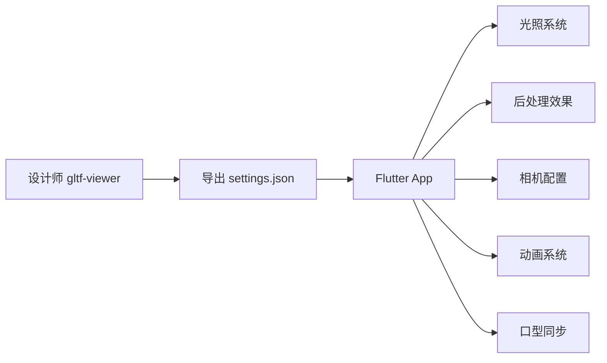

# Flutter Filament 3D 还原设计师效果技术文档

## 项目概述

本文档详细说明如何在 Flutter Filament 应用中精确还原设计师在 Filament gltf-viewer 中调试的 3D 渲染效果。通过系统化的参数配置和技术实现，确保移动端应用与专业工具的视觉一致性。

## 目录

- [核心技术架构](#核心技术架构)
- [还原设计师效果的完整流程](#还原设计师效果的完整流程)
- [关键实现细节](#关键实现细节)
- [口型同步系统](#口型同步系统)
- [资源文件组织](#资源文件组织)
- [最佳实践](#最佳实践)
- [常见问题解决](#常见问题解决)

## 核心技术架构

### 技术栈

| 组件 | 技术选型 | 说明 |
|------|---------|------|
| 3D 渲染引擎 | `thermion_flutter` | 基于 Google Filament |
| 渲染器 | `ThermionViewer` | 核心渲染管理器 |
| 资源管理 | `ThermionAsset` | 支持 GLB/GLTF 格式 |
| 输入控制 | `DelegateInputHandler` | 轨道相机控制 |
| 音频同步 | `audioplayers` | 口型同步音频驱动 |

### 功能模块



## 还原设计师效果的完整流程

### 步骤 1: 获取设计师配置文件

设计师在 Filament gltf-viewer 中调试完成后，需要导出配置：

```bash
# 在 gltf-viewer 中
File → Export Settings → JSON → 保存为 settings.json
```

### 步骤 2: 解析配置文件结构

```json
{
  "lighting": {
    "enableShadows": true,
    "enableSunlight": true,
    "sunlightIntensity": 75000,
    "sunlightDirection": [0.366695, -0.357967, -0.858717],
    "sunlightColor": [0.955105, 0.827571, 0.767769],
    "sunlightHaloSize": 10,
    "sunlightHaloFalloff": 80,
    "sunlightAngularRadius": 1.9,
    "iblIntensity": 15600,
    "iblRotation": 0.558505
  },
  "view": {
    "antiAliasing": "FXAA",
    "msaa": {
      "enabled": true,
      "sampleCount": 4
    },
    "taa": {
      "enabled": true
    },
    "bloom": {
      "enabled": true,
      "strength": 0.348,
      "resolution": 384,
      "levels": 6
    },
    "colorGrading": {
      "toneMapping": "ACES_LEGACY",
      "exposure": 0,
      "contrast": 1,
      "saturation": 1
    },
    "ssao": {
      "enabled": true,
      "radius": 0.3,
      "intensity": 1,
      "quality": "LOW"
    },
    "screenSpaceReflections": {
      "enabled": true
    }
  },
  "viewer": {
    "cameraFocalLength": 46.488,
    "cameraAperture": 16,
    "cameraSpeed": 125,
    "cameraISO": 100,
    "cameraNear": 0.1,
    "cameraFar": 100
  }
}
```

### 步骤 3: 实现专业光照系统

#### 3.1 主光源配置

```dart
Future<void> applyLightsFromSpec(ThermionViewer viewer) async {
  // 清除现有光源
  try {
    await viewer.destroyLights();
  } catch (_) {}

  // 主太阳光 - 基于设计师 settings.json 参数
  await viewer.addDirectLight(DirectLight.sun(
    color: 5400.0,                    // 色温 (K)
    intensity: 75000.0,               // 来自 sunlightIntensity
    castShadows: true,                // 启用阴影
    direction: Vector3(0.366695, -0.357967, -0.858717), // 精确方向
  ));
}
```

#### 3.2 五点光照系统

为确保角色各个角度都有良好的光照效果，实现专业的五点光照配置：

```dart
// 正面补光 - 增强正脸亮度
await viewer.addDirectLight(DirectLight.sun(
  color: 5600.0,
  intensity: 30000.0,
  castShadows: false,
  direction: Vector3(0.1, -0.4, -0.9).normalized(),
));

// 背面环境光 - 避免背面全黑
await viewer.addDirectLight(DirectLight.sun(
  color: 5800.0,
  intensity: 25000.0,
  castShadows: false,
  direction: Vector3(-0.2, -0.3, 0.9).normalized(),
));

// 左侧补光 - 减少侧面阴影
await viewer.addDirectLight(DirectLight.sun(
  color: 5700.0,
  intensity: 18000.0,
  castShadows: false,
  direction: Vector3(-0.8, -0.2, -0.3).normalized(),
));

// 右侧轮廓光 - 增强立体感
await viewer.addDirectLight(DirectLight.sun(
  color: 6200.0,
  intensity: 15000.0,
  castShadows: false,
  direction: Vector3(0.8, -0.1, 0.5).normalized(),
));
```

### 步骤 4: 配置 IBL 环境光照

IBL (Image-Based Lighting) 配置是还原设计师效果的关键：

```dart
// 加载天空盒
await viewer.loadSkybox(
  "assets/environments/studio_small_env_skybox.ktx"
);

// 加载 IBL
await viewer.loadIbl(
  "assets/environments/studio_small_env_ibl.ktx",
  intensity: 15600.0  // 来自 iblIntensity
);

// ⚠️ 关键步骤：IBL 旋转
// 这个参数经常被忽视，但对最终效果影响巨大
var rotationMatrix = Matrix3.identity();
Matrix4.rotationY(0.558505).copyRotation(rotationMatrix); // iblRotation
await viewer.rotateIbl(rotationMatrix);
```

### 步骤 5: 后处理效果配置

```dart
// 启用后处理
await viewer.setPostProcessing(true);

// 启用阴影系统
await viewer.setShadowsEnabled(true);

// 色调映射 - ACES 是最接近 ACES_LEGACY 的选项
await viewer.setToneMapping(ToneMapper.ACES);

// Bloom 效果
await viewer.setBloom(
  true,     // enabled
  0.348     // strength
);

// 抗锯齿配置
await viewer.setAntiAliasing(
  true,     // MSAA enabled
  true,     // FXAA enabled
  true      // TAA enabled
);
```

### 步骤 6: 相机曝光设置

```dart
// 获取活动相机
final camera = await viewer.getActiveCamera();

// 设置曝光参数
await camera.setExposure(
  16.0,         // aperture (f/16)
  1.0 / 125.0,  // shutterSpeed (1/125s)
  100.0         // ISO
);
```

## 关键实现细节

### 色温转换参考

设计师配置中的 RGB 颜色需要转换为 Kelvin 色温：

| RGB 值 | 近似色温 | 描述 |
|--------|---------|------|
| [0.955, 0.828, 0.768] | ~5400K | 暖白色 |
| [1.0, 0.9, 0.8] | ~5600K | 日光 |
| [0.9, 0.95, 1.0] | ~6200K | 冷白色 |

### 相机 FOV 计算

根据焦距计算视场角：

```dart
// 焦距与 FOV 对应关系（35mm 等效）
// 46.488mm → 45° FOV (标准视角)
// 80.528mm → 27° FOV (长焦视角)
// 28.000mm → 75° FOV (广角视角)

CameraRigConfig _configFor(CameraPreset preset) {
  switch (preset) {
    case CameraPreset.soloCloseUp:
      return CameraRigConfig(
        fovDegrees: 45,  // 根据 46.488mm 焦距
        eyeOffset: Vector3(0.0, 0.5, 2.8),
        centerOffset: Vector3(0.0, 0.5, 0.0),
      );
    // ... 其他预设
  }
}
```

### 动画状态管理

```dart
// 动画状态枚举
enum AnimState { none, idle, talk }

// 智能动画识别
void _matchAnimationIndices(List<String> animations) {
  // Idle 动画关键词
  const idleKeywords = ['idle', 'wait', 'stand'];

  // Talk 动画关键词
  const talkKeywords = ['talk', 'speak', 'speech'];

  // 优先选择不含 'skeleton' 或 '#' 的干净名称
  for (int i = 0; i < animations.length; i++) {
    final animName = animations[i].toLowerCase();
    final isCleanName = !animName.contains('skeleton') &&
                       !animName.contains('#');
    // 匹配逻辑...
  }
}
```

## 口型同步系统

### 系统架构

```dart
class LipSyncController {
  // 核心参数
  bool enableSmoothing = true;  // 平滑插值
  double phaseOffsetMs = 0.0;   // 相位偏移
  double weightMultiplier = 1.0; // 权重倍率

  // 通道增益控制
  final Map<String, double> channelGains = {
    'jawopen': 0.7,
    'jaw': 0.85,
    'mouthfunnel': 0.6,
    'mouthpucker': 0.6,
    'mouthstretch': 0.8,
    'mouth': 0.9,
  };
}
```

### Blendshape 数据格式

```json
// bs.json 结构
[
  [0.0, 0.1, 0.5, ...],  // 第1帧的52个权重值
  [0.2, 0.3, 0.1, ...],  // 第2帧的52个权重值
  // ... 更多帧
]
```

### 同步播放流程

```dart
await lipSyncController.playLipSync(
  audioPath: 'wav/output.wav',
  frameRate: 60.0,
  attenuation: 0.8,
  pauseIdleAnimation: () async {
    // 停止 idle 动画避免冲突
    await stopAllAnimations();
  },
  resumeIdleAnimation: () async {
    // 恢复 idle 动画
    await startIdleLoop();
  },
);
```

## 资源文件组织

```
项目根目录/
├── assets/
│   ├── environments/
│   │   ├── studio_small_env_ibl.ktx      # IBL 环境光贴图
│   │   ├── studio_small_env_skybox.ktx   # 天空盒贴图
│   │   └── default_env_*.ktx             # 默认环境
│   ├── models/
│   │   ├── xiaomeng_ani_0918.glb        # 角色模型
│   │   └── character.glb                 # 备选模型
│   └── wav/
│       ├── bs.json                       # Blendshape 权重数据
│       └── output.wav                    # 口型同步音频
├── lights/
│   ├── settings.json                     # 设计师主配置
│   └── setting_new.json                  # 更新的配置
└── lib/
    ├── main.dart                         # 主应用逻辑
    ├── lip_sync_controller.dart          # 口型同步控制器
    └── camera_presets.dart               # 相机预设配置
```

## 最佳实践

### 1. 参数精确匹配

✅ **必须精确匹配的参数**：
- `sunlightDirection` - 光照方向
- `iblRotation` - IBL 旋转角度
- `toneMapping` - 色调映射算法
- `cameraFocalLength` - 相机焦距

⚠️ **可以微调的参数**：
- 补光强度（根据模型特点）
- Bloom 强度（根据显示设备）
- SSAO 参数（根据性能需求）

### 2. 性能优化建议

```dart
// 根据设备性能动态调整
if (isHighEndDevice) {
  await viewer.setAntiAliasing(true, true, true);  // 全开
  await viewer.setBloom(true, 0.348);
} else {
  await viewer.setAntiAliasing(true, true, false); // 关闭 TAA
  await viewer.setBloom(true, 0.2);                // 降低 Bloom
}
```

### 3. 调试技巧

```dart
// 启用详细日志
if (kDebugMode) {
  debugPrint('☀️ 太阳光配置: 强度=${intensity}, 方向=${direction}');
  debugPrint('🌍 IBL 配置: 强度=${iblIntensity}, 旋转=${rotation}');
  debugPrint('📷 相机配置: 焦距=${focalLength}mm, FOV=${fov}°');
}
```

## 常见问题解决

### Q1: 渲染效果与设计师预期不一致

**检查清单**：
1. ✓ IBL 旋转角度是否正确设置？
2. ✓ 色温是否正确转换？
3. ✓ 所有光源方向是否精确匹配？
4. ✓ 后处理效果是否全部启用？

### Q2: 模型过暗或过亮

**解决方案**：
```dart
// 调整曝光补偿
camera.setExposure(
  aperture,
  shutterSpeed,
  ISO * exposureCompensation  // 乘以补偿系数
);

// 或调整 IBL 强度
await viewer.loadIbl(path, intensity: originalIntensity * 1.2);
```

### Q3: 口型同步不准确

**调试步骤**：
1. 检查音频帧率与动画帧率是否匹配
2. 调整相位偏移参数 `phaseOffsetMs`
3. 检查 Morph Target 名称映射
4. 验证 blendshape 数据完整性

### Q4: 性能问题

**优化策略**：
- 降低阴影贴图分辨率
- 减少光源数量
- 关闭不必要的后处理效果
- 使用更低的抗锯齿级别

## 验证检查表

- [ ] 主光源强度与方向匹配
- [ ] IBL 强度与旋转角度正确
- [ ] 5点光照系统已配置
- [ ] 后处理效果已启用
- [ ] 相机曝光参数已设置
- [ ] 色调映射算法正确
- [ ] Bloom 效果强度匹配
- [ ] 抗锯齿配置完整
- [ ] 阴影系统已启用
- [ ] 天空盒正确加载

## 总结

通过严格遵循本文档的配置流程和参数设置，可以在 Flutter 应用中精确还原设计师在 Filament gltf-viewer 中调试的视觉效果。关键成功因素：

1. **准确获取配置** - 从设计师工具直接导出
2. **精确实现参数** - 特别注意 IBL 旋转
3. **完整的光照系统** - 主光源 + 补光配置
4. **匹配后处理链** - 按顺序配置所有效果
5. **持续验证调试** - 使用检查表确认

记住：**细节决定成败**，每一个参数都可能影响最终效果。

---

*文档版本: 1.0.0*
*最后更新: 2024*
*适用版本: thermion_flutter 0.3.3+*